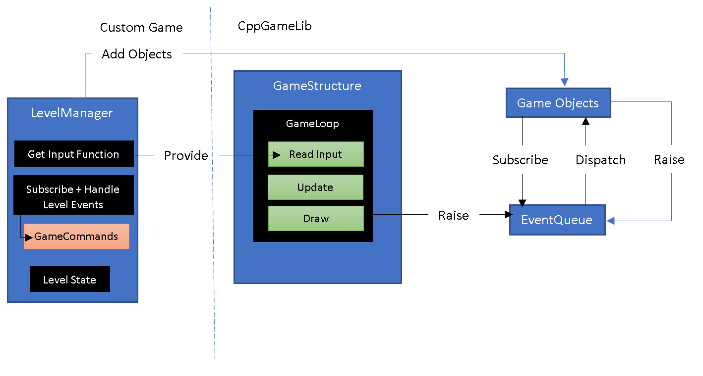

# cppgamelib
This is a game library for C++ for creating simple 2D games.

## Introduction

TODO

A Basic view of how the library would be used to structure a game:



## Core

### GameObject

`GameObject` is any object that can be drawn via its `Draw()` function and be updated via its `Update()` function. 

Typically objects in the game inherit from GameObjects so that they can subscribe to events, draw and update as well as have a position and space (bounds) on screen.

* All GameObjects are event subscribers.
* All Game Objects have a `Bounds`, `Position` might be `Visible` and can load its own Settings via `LoadSettings()`. 
* All GameObjects have a unique ID


#### GameObjectFactory

A `GameObjectFactory` object creates specific types of GameObjects from their XML definitions. Currently supports ability to rehydrate the following game types:
* `AnimatedSprite`
* `StaticSprite`


## GameStructure

`GameStructure` is a crucial part of any game. This object is used to structure the game parts. It is responsible for executing the GameLoop at the desired framerate and drawing asking the `SceneManager` to draw all the objects in the scene, as well as getting the controller input through the controller input function that you provide in the constructor.

It is also the place where all the subsystems are initialized (via `Initialize()`) before the game is put into the game loop. 

* Make sure you call Initialize() before you try and run the game loop.

```cpp
int main(int argc, char *args[])
{
	try
	{
		// Create our game structure that uses the level manager's polling function for keyboard input
		GameStructure infrastructure([&]() { LevelManager::Get()->GetKeyboardInput(); });
				
		gameStructure.Initialize(screenWidth, screenHeight, windowTitle, "game\\Resources.xml", "game\\settings.xml");
		
		// Load level and create/add game objects
		PrepareFirstLevel();
		
		// Start the game loop which will pump update/draw events onto the event system, which level objects subscribe to
		infrastructure.DoGameLoop(GameData::Get());
		
		infrastructure.Unload();
	}
	catch(EngineException& e)
	{
		MessageBoxA(nullptr, e.what(), "Game Error!", MB_OK);
		
		ErrorLogManager::GetErrorLogManager()->Buffer << "****ERROR****\n";
		ErrorLogManager::GetErrorLogManager()->Flush();
		ErrorLogManager::GetErrorLogManager()->LogException(e);
		ErrorLogManager::GetErrorLogManager()->Buffer << "*************\n";
		ErrorLogManager::GetErrorLogManager()->Flush();
	}
return 0;
}	
```

The GameStructure is passed a game settings file and a resources file. See the `GameSettingsManager` and `ResourceManager` respectively for details on the format.

The `GameStructure` also handles calling a controller input function during the gameloop.

### Example of Controller Input function

```cpp
void LevelManager::GetKeyboardInput() const
{
	SDL_Event sdlEvent;
	const auto keyState = SDL_GetKeyboardState(nullptr);

	if (keyState[SDL_SCANCODE_UP] || keyState[SDL_SCANCODE_W]) { gameCommands->MoveUp(verbose); }
	if (keyState[SDL_SCANCODE_DOWN] || keyState[SDL_SCANCODE_S]) { gameCommands->MoveDown(verbose); }
	if (keyState[SDL_SCANCODE_LEFT] || keyState[SDL_SCANCODE_A]) { gameCommands->MoveLeft(verbose); }
	if (keyState[SDL_SCANCODE_RIGHT] || keyState[SDL_SCANCODE_D]) { gameCommands->MoveRight(verbose); }
		
	while (SDL_PollEvent(&sdlEvent))
	{		
		if (sdlEvent.type == SDL_KEYDOWN)
		{
			switch (sdlEvent.key.keysym.sym)
			{
 				// Raise events via the EventManager					
				case SDLK_q: 
				case SDLK_ESCAPE: gameCommands->Quit(verbose); break;
				case SDLK_r: gameCommands->ReloadSettings(verbose); break;
				case SDLK_p: gameCommands->PingGameServer(); break;
				case SDLK_n: gameCommands->StartNetworkLevel(); break;
				case SDLK_SPACE: gameCommands->Fire(verbose); break;
				case SDLK_0: gameCommands->ToggleMusic(false); break;
			default: /* Do nothing */;
			}
		}
		
		if (sdlEvent.type == SDL_QUIT)  { gameCommands->Quit(verbose); return; }
	}
}
```

## Event management

A key design pattern to decouple GameObjects is to tie them together with events that are subscribed to and raised throughout the game.

### EventManager
The `EventManager` is the central component of the event management system. It is a Singleton which allows supported objects (`IEventSubscriber`) to subscribe and raise `Events`. 

When an event is subscribed to, it is stored in the EventManager's event queue and when an Event is raised that matches the subscribed event, the object that subscribed to the event gets notified. 

All objects that can subscribe and be notified need to inherit from `IEventSubscriber` as this is the interface that the EventManager will use to contact it.

An `Event` can be subscribed to by asking the EventManager to subscribe to it's `EventId` which is a numeric identifier particular to each event and passing yourself (`IEventSubscriber`) as a reference so it can get back to you to notify when the event is raised.

Each event has a particular it to its particular `EventId` that is associated with a known event type, and when they are raised the data associated with the event is also stored in the Event object that is returned to the subscriber. 

```cpp

// Subscribing to events directly via `EventManager`
eventManager->SubscribeToEvent(GenerateNewLevelEventId, this);
...

```

### IEventSubscriber

All objects that are IEventSubscribers (including `GameObject`s) can raise events with the EventManager and typically do so by calling the `RaiseEvent()` function. Also, they can use the `Subscribe()` to subscribe to an event. Internally this calls the EventManager.

```cpp
// Subscribing to events
SubscribeToEvent(PlayerMovedEventTypeEventId);

// Enemy GameObject Raising event to indicate enemy collided with player
RaiseEvent(std::make_shared<PlayerCollidedWithEnemyEvent>(shared_from_this(), player));
...

// handling event notification that were subscribed to
std::vector<std::shared_ptr<gamelib::Event>> Enemy::HandleEvent(const std::shared_ptr<gamelib::Event> event, unsigned long deltaMs)
{
	if (event->Id == gamelib::PlayerMovedEventTypeEventId)
	{
		CheckForPlayerCollision();
	}

	return {};
}
```

## Settings Management

A settings file path is passed to the `GameStructure` which can be accessed via the `SettingsManager`. This file can contain settings for various parts of the game and can be retrieved on demand.

## SettingsManager

The `SettingsManager` allows the retrieval of settings from an xml file which is of the following format:
```xml
<!-- Settings -->
<settings>
  <!-- Global Game Settings -->
  <global>
    <!-- 1 update very 20 ms = 50 times a second (1000 milliseconds) -->
    <setting name="tick_time_ms" type="int">16</setting>
  </global>
...
  <AnotherSection>
    <setting name="YourSetting" type="string">YourSettingValue</setting>
  </AnotherSection>
</settings>
```

Settings can retrieved directly from the `SettingsManager` who manages this file:

```cpp
int tick_time_ms = SettingsManager::Int("global", "tick_time_ms");
```

## Resource Management

Resources are the data that the game can use such as images, sounds etc. 

You specify the resources for your game in an XML file that you pass to the `GameStructure` and then which can subsequently be accessed by using the `ResourceManager`

### ResourceManager

The ResourceManager will read and index all the assets that are defined in the global resources file. It will also ask assets that are associated with a particular scene to load themselves when it receives the `SceneChangedEvent`. Equally in handling this event, it unloads any assets that are now not associated with the current scene. 

You should call `ResourceManager::Initialize()` before using or depending on this behaviour, as this will start indexing the resources file that was provided to the `GameStructure`. The format of the resources file is:

```xml
<?xml version="1.0" encoding="utf-8"?>

<!-- List of all asset in the game -->
<Assets>
  <!-- Audio Assets -->
  <Asset uid="1" scene="4" name="LevelMusic4" type="music" filename="Assets/Music/MainTheme.wav"></Asset>
  <Asset uid="2" scene="0" name="scratch.wav" type="fx" filename="Assets/scratch.wav"></Asset>

  <!-- Graphic Assets -->
  <Asset uid="6" scene="1" name="p1.png" type="graphic" filename="Assets/Platformer/Base pack/Player/p1_front.png" width="66" height="92">

  <!-- Font Assets -->
  <Asset uid="12" scene="0" name="arial.ttf" type="font" filename="Assets/fonts/arial.ttf"></Asset>
  <Asset uid="26" scene="0" name="kenvector_future2.ttf" type="font" filename="Assets/fonts/kenvector_future2.ttf"></Asset>

   <!-- This is a SpriteAsset with extra data such that a AnimatedSprite with a colour key can be created by the GameObjectFactory -->
  <Asset uid="18" scene="0" name="snap_player" type="graphic" filename="game/assets/character2.png" width="32" height="32">
     <colorkey red="255" blue="255" green="255"/>
     <sprite> 
      <animation>
        <keyframes duration="150"> <!-- Wait 0 ms before switching to next frame -->
	        <keyframe x="0" y="0" w="32" h="32" group="up"/>
	        <keyframe x="32" y="0" w="32" h="32" group="up"/>
	        <keyframe x="64" y="0" w="32" h="32" group="right"/>
	        <keyframe x="96" y="0" w="32" h="32" group="right"/>
	        <keyframe x="128" y="0" w="32" h="32" group="down"/>
	        <keyframe x="160" y="0" w="32" h="32" group="down"/>
	        <keyframe x="192" y="0" w="32" h="32" group="left"/>
	        <keyframe x="224" y="0" w="32" h="32" group="left"/>
        </keyframes>
      </animation> 
    </sprite>  
  </Asset>
...
</Assets>

```

The `ResourceManager` keeps a list of all the resources by keeping a list of `Asset`s (see Assets). It essentially tracks all resources whether they are loaded or not.

The `ResourceManager` can also be consulted to return information about the assets in the resources file, as it effectively manages the resources specified therein. 

`ResourceManager::GetAssetInfo()` can be used to obtain the asset associated with a specific asset Id or asset name. You can also query the number of loaded or unloaded resources (`GetCountLoadedResources()` and `GetCountUnloadedResources()` respectively ) and get the total number of resources that the resource manager knows about.

## Scene Management
### SceneManager

The `SceneManager` is responsible for drawing the objects that are associated with the current scene. It subscribes to the `DrawCurrentSceneEventId` event Id which is raised within the game loop and is called as often as possible between the calls to the desired update() calls each frame (to achieve the desired fixed update frame rate)

The `SceneManager` also is responsible for adding items to the scene. The scene is composed of Layers and each layer can have items that can be added to that layer. The SceneManager will then traverse the layers in order to draw the scene and in so doing achieve z-order drawing, i.e. the ability to draw some object over others.

The `SceneManager` typically subscribes to scene change events and events asking it to load an item into a particular layer in the scene. The `SceneManager` will also do this by reading the associated scene or level file associated with the scene and load the contents thereof into the scene.

#### Example Scene File

```xml
<?xml version="1.0" encoding="utf-8"?>

<!-- Objects in Scene/Level 3 -->
<scene id="2">
	<layer name="layer0" posx="0" posy="0" visible="true">
		<objects>
			<object name="name3" type="graphic" posx="100" posy="40" resourceId="9" visible="true"></object>
      <object name="name4" type="graphic" posx="400" posy="40" resourceId="11" visible="true"></object>
     <object name="name5" type="graphic" posx="400" posy="40" resourceId="18" visible="true"></object>
		</objects>
	</layer>
</scene>
```

### Layer

A layer is named a collection of `GameObject`s that are in that layer. A layer has a z-order which dictates the order in which the GameObjects in the layer are drawn by the `SceneManager`.

## Geometry

### ABCDRectangle

An `ABCDRectable` is a model of the geometry of a rectangle. 

```cpp
/*
 An ABCD Rectangle looks like this;

	A----B
	|    |
	|    |
	D----C

Each point A, B, C, D has and x,y coordinate

	A(ax,ay)----B(bx,by)
	|                  |
	|                  |
	D(dx,dy)----C(cx,cy)

*/
```

## Asset Support

The `Asset` class is an object that holds a path to an asset file, like an image file or sound file and then is able to load that asset into memory. 

Each asset has an associated `Uid` that distinguishes this asset from others. Each asset can be either of type (Graphic, Sprite, Audio, Font) and additionally can be associated with a particular scene via the `SceneId`

There are a variety of built-in assets that derive from Asset and therefore have the overriding ability to Load() and Unload() themselves into/from memory.

### AudioAsset
Loads/unloads and holds a reference to an audio clip that is used in a scene

Currently, the asset can have an asset type of `SoundEffect` or `Music` which distinguishes between a short-player fx clip or a long-playing music clip.

The `AudioManager` can construct these.

### FontAsset

Loads/unloads and holds a reference to a font that is used in a scene.

### GraphicAsset

A `GraphicAsset` is an asset that knows how to load a graphic into memory.

### SpriteAsset

Loads/unloads and holds a reference to an spritesheet that is used in the scene

## Audio Management

Audio assets are managed by the `AudioManager` which can `Play()` provided `AudioAssets`.

```cpp
const auto asset = ResourceManager::Get()->GetAssetInfo(levelMusicAssetName);
AudioManager::Get()->Play(asset);	
```

## Font Management

The `FontManager` creates `FontAsset`s that can be tracked in the `ResourceManager`

## Graphics

All `GameObjects` can `Draw()` themselves by writing to the surface that is provided to them.

* Typically it is the `SceneManager` that calls the `Draw()` function for each GameObject in the scene and it passes the surface that is provided by the `SDLGraphicsManager`. 
* The surface is only shown when the `SDLGraphicsManager` shows what has been written to the surface by calling the `SDLGraphicsManager::ClearAndDraw()` which is also involved by the SceneManager when all objects in the scene has been given a chance to write to the surface.

### SDLGraphicsManager

The `SDLGraphicsManager` is responsible for setting up the Window and its associated drawable surface.

* You should call `Initialize()` before first use of `SDLGraphicsManager::ClearAndDraw()`

#### DrawableGameObject

A `DrawableGameObject` is a game object that can load and draw itself. By default, it supports drawing a `GraphicAsset` but can perform its own drawing too. It supports setting the `ColourKey` when drawing the graphic

### DrawableText

`DrawableText` is a game object that draws a string of text.

### DrawableFrameRate

The `DrawableFrameRate` is a game object that shows the current framerate.

### GraphicAssetFactory

A `GraphicAssetFactory` creates `GraphicAsset` from serialized XML 

### ColourKey

A `ColourKey` is a colour that is considered invisible when drawing a graphic that has the colour key colour in it.

### KeyFrame

A `KeyFrame` is an area on a sprite sheet. Each keyframe usually represents a different image within a sprite sheet. Cycling through a series of keyframes usually represents a particular animation. Such a series is keyframes can be associated with an identifier or 'group'.


### Drawing

The `Drawing` class is a utility function for drawing operations

### Logging and Error Management

#### ErrorLogManager

The `ErrorLogManager` creates a log file that errors are written to.

## Character Management

#### NPC

An `NPC` is a `DrawableGameObject` that uses an `AnimatedSprite` with support for moving, and having its animation change according to the direction it is facing. It also supports drawing a label affixed to its top left corner which can be used to show the current state of the NPC.

It currently has 5 fixed behavioural states that are controlled by a `FiniteStateMachine` and has the following states:

* hitWallState, which switches the current direction of the NPC
* upState, which moves the NPC up
* downState, which moves the NPC down
* leftState, which moves the NPC left
* rightState, which moves the NPC right.

The exact behaviour of the NPC can be specified by the derived class, which is what the `Enemy` class does.

#### Direction

An enumeration of Directions:

```cpp
enum class Direction 
{ 
	Up, 
	Down,
	Left, 
	Right,
	None
};
```

#### Component

A `Component` is a named item that has a list of key-value properties associated with it. 


#### Hotspot

A `Hotspot` is a `DrawableGameObject` that has a position within its parent. 

Note: A hotspot should move with its parent's position. Currently, this is a pain because we have to do this manually, i.e when the parent changes, we need to calculate the position of the hotspot by passing in the parents co-ordinates. This will be improved when we have a dedicated scene graph where relationships between parents and children will easily allows this to happen automatically.

#### Inventory

An `Inventory` is a collection of `Components`. This would typically be associated with a Player or NPC.

You can search for a component, remove a component and check if a component exists in the `Inventory`.

#### AnimatedSprite

An `AnimatedSprite` is a Drawable Game Object that draws a time-based keyframe animation, using the supplied `SpriteAsset`. It is used by `NPC`.  

#### StaticSprite

An `StaticSprite` is a sprite that does not support a time-based keyframe animation, but one in which the keyframes can be manually set.

## Movement
### Movement

A `Movement` is the number of pixels to move in a particular direction.

### IGameObjectMoveStrategy

An `IGameObjectMoveStrategy` makes a `Movement`.

## Time

### Timer

A `Timer` is a countdown timer that elapses when the timer has been run for the duration of the timer. It allows you to check if an event that started when the timer started has now been happening for a specific amount of time.  


## Processes

### Process

A `Process` is like a workflow or a sequence. A process can contain multiple processes, which can be nested or not, like:

Process 1: [ processA, processB, processC: [process X, processY, processZ]]

A process can have either one of the following states:

* Uninitialized = 0,
* Running
* Succeeded
* Failed
* Aborted

Processes support an `OnInit()`,`OnUpdate()` `OnFail()`, `OnSuccess()` function which will run depending on the state of the process.

Processes can also call `Succeed()`, `Fail()`, `Pause()` to change its status.

The premise is that a process will be managed by a `ProcessManager` whose responsibility it is to start executing the process which involves giving each process time slices for updating its progress over time. 

### Action

An `Action` is a process that succeeds (sets is status to succcess) after is associated action is run.

### DelayProcess

A `DelayProcess` is a process that waits, and then runs its action before reporting its status as success.

### ProcessManager

The `ProcessManager` runs each process by giving it time-slices. 

### Example

```cpp
const auto a = std::static_pointer_cast<Process>(std::make_shared<Action>([&]() { ActionA(); }));
const auto b = std::static_pointer_cast<Process>(std::make_shared<Action>([&]() { ActionB(); }));
const auto c = std::static_pointer_cast<Process>(std::make_shared<DelayProcess>(5000)); // Wait 5 secs
const auto d = std::static_pointer_cast<Process>(std::make_shared<Action>([&]() { ActionD(); }));

// Chain a set of subsequent processes
a->AttachChild(b); 
	b->AttachChild(c); 
		c->AttachChild(d);

processManager.AttachProcess(a);
...
processManager.Update(deltaMs);
```

## AI

### Finite State Machines

#### FSM

The `FSM` class is the Finite State Machine that manages the execution and transition of loaded states.

#### FSMState

The `FSMState` class is a state that can be loaded into the FSM and be executed depending on if a transition (`FSMTransition`) exists for it

#### FSM transition

A `FSMTransition` is a condition that specifies that the associated state should be executed or transitioned to.

### Behaviour Trees

#### BehaviorTree

The `BehaviorTree` class holds a hierarchy of behaviours. It is essentially the root node of the tree.

#### FirstOrNextSelector 

The `FirstOrNextSelector` node can be added to a `BehaviorTree` and it will cycle through its child nodes, executing the same child while that child's condition is met.

#### LastOrNextSelector

The `LastOrNextSelector` node a can be added to a `Behavior Tree` which will continue to execute the last child node is executed previously (while the conditions for that child node are still true. This is essentially executing a sticky while it is valid, and then moving to the next child node in the sequence when its condition becomes false.

#### Sequence

The `Sequence` node is a behaviour that executes each child node in the sequence. You can add child nodes that will execute in sequence

#### Behavior

The `Behavior` node is an action that will execute when it is reached. A behavior can be a child of a sequence or condition

#### BehaviorTreeBuilder

Allows the construction of a `BehaviorTree` declaratively for example

```cpp
gamelib::BehaviorTree* behaviorTree = BehaviorTreeBuilder()
.ActiveSelector()
 .Sequence("Check if player is visible")
  .Condition(IsPlayerVisible)
  .ActiveSelector()
   .Sequence()
    .Condition(IsPlayerInRange)
    .Filter()
     .Action(FireAtPlayer)
    .Finish() 
   .Finish()
   .Action(MoveTowardsPlayer)
 .Finish()
.Finish()
.Sequence("Check if player spotted")
 .Condition(HaveWeGotASuspectedLocation)
  .Action(MovePlayerToLastKnownLocation)
  .Action(LookAround)
 .Finish()
 .Sequence("Act normal")
  .Action(MoveToRandomPosition)
  .Action(LookAroundSomeMore)
 .Finish()
 .Sequence("Do something else")
  .Action(DummyAction7)
  .Action(DummyAction8)
 .Finish()
.Finish()
.Finish()
.End();
```

## Networking 

TBD

## Built-in Events

### PlayerMovedEvent

This Event is raised when the code that registers a up/down/left/right controller press is detected. Typically this is subscribed to by the `Player` so that the player can move itself.

### GameObjectEvent

This Event is always associated with a particular `GameObject` and serves as a convenient way to raise events about them. The specific thing that the event relates to is encoded in the Event's `Context` member which is of type `GameObjectEventContext` and currently specifies two contexts:

1. Remove
2. RemoveSubscription

### SceneChangedEvent

This Event is raised when a particular scene is being changed, typically in response to a new level starting where a scene can be interpreted as a level. The event carries with it the `SceneId` that was changed to. This is used by the `ResourceManager` to unload resources that are not for that scene and load resources that are.

### SceneLoadedEvent 

This event is raised when the scene is completely loaded, i.e the resources for that scene have all been loaded into memory and theoretically, that scene can be presented/drawn.

### StartNetworkLevelEvent

This event is raised when its time to start a level in a networked game. The idea is that the event is propagated to all players who have joined a network game. It contains which level they should all load.

#### UpdateAllGameObjectsEvent

This event is raised in the game loop when objects so can update themselves. 

### NetworkPlayerJoinedEventId

This event is raised when a network player joins.

### NetworkTrafficReceivedEvent

This event is raised when network traffic is received. 

### AddGameObjectToCurrentSceneEvent

This event is raised when an object needs to be added to the scene. This is typically subscribed to by the `SceneManager`. 

### LevelChangedEventTypeEventId
TBD

### Miscellaneous Objects

#### GameWorldData

An object that holds the game's common state such as `IsGameDone`, `IsNetworkGame`, `CanDraw` and most importantly, a reference to the player `GameObject`.  


# Dependencies:
 ## Include
 * C:\SDL\SDL2\include 
 * C:\SDL\SDL2_image-2.0.4\include 
 * C:\SDL\SDL2_mixer-devel-2.0.4-VC\SDL2_mixer-2.0.4\include 
 * C:\SDL\SDL2_ttf-2.0.15\include 
 * C:\Program Files (x86)\Microsoft DirectX SDK (June 2010)\Include (not needed yet)
 ## Link
 * C:\Program Files (x86)\Microsoft DirectX SDK (June 2010)\Lib\x86  (not needed yet)
 * C:\SDL\SDL2\lib\x86 
 ## libs
 * SDL2.lib
 * SDL2main.lib
 * SDL2_image.lib
 * Winmm.lib
 * SDL2_mixer.lib
 * d3d10.lib (not needed yet)
 * d3dx10.lib (not needed yet)
 * SDL2_ttf.lib

To use you'll the library in your game, you'll need to link to cppgamelib.lib

